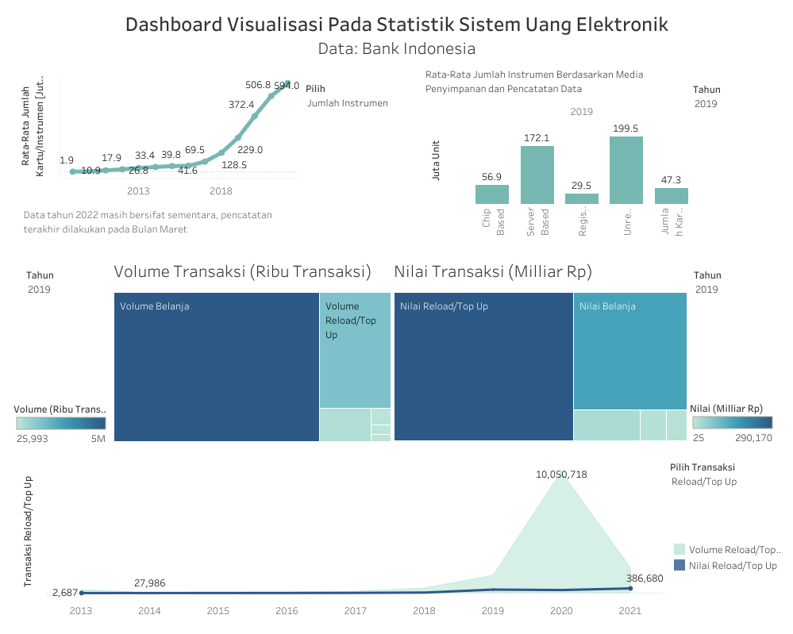

# Dokumentasi Penyusunan Dashboard Visualisasi pada Statistik Sistem Uang Elektronik

## Penjelasan Data dan Metadata
Sumber data yang digunakan pada visualisasi ini adalah data statistik sistem pembayaran/uang elektronik dari Bank Indonesia. Data ini menyediakan data dari tahun 2009 hingga tahun 2022, meskipun pada tahun 2022 data terakhir kali dicatat pada Bulan Maret dan masih bersifat sementara. Variabel dan Sub-variabel yang digunakan antara lain:
- Jumlah Instrumen: jumlah uang elektronik yang beredar di masyarakat pada periode tertentu.
  - Berdasarkan media penyimpan
    - *Chip Based*
    - *Server Based*
  - Berdasarkan pencatatan data
    - *Registered*
    - *Unregistered*
  - Jumlah Kartu dalam Rangka LKD
- Volume Transaksi: jumlah transaksi pembelanjaan yang dilakukan dengan menggunakan uang elektronik pada periode tertentu.
  - Volume Transaksi Belanja
  - Volume Transaksi Transfer antar Uang Elektronik
  - Volume Transaksi *Initial* (isi pertama kali)
  - Volume Transaksi *Reload/Top Up*
  - Volume Transaksi Tarik Tunai Uang Elektronik
  - Volume Transaksi *Redeem*
- Nilai Transaksi: nilai/nominal dari transaksi pembelanjaan yang dilakukan dengan menggunakan uang elektronik pada periode tertentu.
  - Nilai Transaksi Belanja
  - Nilai Transaksi Transfer antar Uang Elektronik
  - Nilai Transaksi *Initial* (isi pertama kali)
  - Nilai Transaksi *Reload/Top Up*
  - Nilai Transaksi Tarik Tunai Uang Elektronik
  - Nilai Transaksi *Redeem*
- Penyelenggara Uang Elektronik
  - Penerbit:  adalah Bank atau Lembaga Selain Bank yang menerbitkan uang elektronik
    - Bank Umum
    - Lembaga Selain Bank/LSB

## Preprocessing
Agar Tableau dapat memproses data sesuai dengan yang diinginkan, maka harus ada perubahan struktur tabel terlebih dahulu.
Data awal berbentuk seperti ini  

Lalu dilakukan transformasi tabel menjadi seperti ini  

Setelah tabel berhasil di transformasi, dilakukan penghapusan *missing value*, jadi akan ada beberapa variabel yang tidak digunakan dan visualisasi pada tahun lampau tidak bisa ditampilkan. Setelah itu data di export ke Tableau. Namun ketika pertama kali di export ternyata tipe data yag terdeteksi oleh Tableau tidak sesuai yang diinginkan, yang seharusnya tipe data numerik justru terbaca menjadi tipe data kategori. Oleh karena itu dilakukan perubahan tipe data di Tableau, dan data yang sudah diubah tipe datanya di *drag-and-drop* ke bagian numerik.     
Awalnya seperti ini  
<p align="center">
 
</p>
menjadi seperti ini  
<p align="center">

</p>

## Proses Visualisasi
Proses visualisasi akan dijelaskan per-variabel

### Jumlah Instrumen
Variabel ini akan divisualisasikan dengan menggunakan *line chart*
1. *Drag-and-drop* variabel Jumlah Instrument ke `Rows shelf` dan variabel Bulan Tahun ke `Columns shelf`. Setelah itu ubah `Measure` pada Jumlah Instrumen menjadi `Average` dan pada Bulan Tahun pilih `Year` untuk menampilkan data per-tahun.
2. Biasanya pada tampilan di Tableau, secara otomatis visualisasi akan berbentuk tabel, jadi pada tab `Marks`, pada *drop down* yang awalnya `Automatic`, ganti menjadi `Line`.
3. Ubah warna dengan memilih `Color` di tab `Marks`.
4. Agar semua nilai rata-rata jumlah instrumen uang elektronik per-tahun terlihat pada visualisasi, pada tab `Marks` pilih `Label` dan beri tanda checklist pada kolom `Show mark labels`.
5. Ketika di *hover* akan muncul tulisan   
   ```
   Tahun: 2015     
   Jumlah Instrumen: 39.8   
   ```
   Biasanya hal penulisan seperti itu masih menyesuaikan pada nama variabelnya sehingga jadinya akan seperti ini  
   ```
   Year of Bulan Tahun:2015  
   Avg.Jumlah Instrumen: 39.8  
   ```
   Hal tersebut sangat tidak diinginkan. Oleh karena itu, agar tidak muncul seperti itu, pada tab `Marks` pilih `Tooltip` lalu ganti tulisan "Year of Bulan Tahun" menjadi "Tahun" dan "Avg.Jumlah Instrumen" menjadi "Jumlah Instrumen".
6. Karena pada visualisasi nilai rata-rata jumlah instrumen uang elektronik per-tahun sudah terlihat pada grafik, maka `Axis y` tidak dibutuhkan, lalu `Grid lines` juga tidak diperlukan. Untuk menghilangkan `Axis y` bisa dengan klik kanan pada `Axis y`, lalu pilih tab `Tick Marks`, pada pilihan `Major Tick Marks` pilih `None`. Untuk menghilangkan `Grid lines` bisa dengan klik kanan pada background grafik, lalu pilih `Format`, setelah itu akan muncul tab `Format Lines`, pada `Grid Lines` pilih `None`. Hal ini dilakukan pada `Rows` dan `Columns`.
7. Jika sudah selesai maka ganti `Title` menjadi "Jumlah Instrumen".    
Hasilnya menjadi seperti ini   
   

#### Jumlah Instrumen Berdasarkan Media Penyimpan dan Pencatatan Data
Variabel-variabel ini akan divisualisasikan dengan menggunakan *bar chart*.
1. Sama seperti yang sebelumnya, dilakukan drag-and-drop variabel Bulan Tahun dan Measure Names ke `Columns shelf`. Pada Measure Names, klik tanda panah ke bawah dan pilih `Edit Filter` dan beri check list pada variabel Chip Based, Server Based, Registered, Unregistered, dan Jumlah Kartu dalam rangka LKD. Variabel Bulan Tahun sama seperti sebelumnya, diubah menjadi `Year`. Lalu pada `Rows shelf` drag-and-drop variabel Measure Values. Pada tab `Measure Values` akan muncul variabel-variabel yang tadi sudah di checklist, lalu ubah `Measure` semua variabel tersebut menjadi `Average`.
2. Pada tab `Marks`, yang awalnya `Automatic`, ubah menjadi `Bar`.
3. Drag-and-drop variabel Bulan tahun ke tab `Filter`. Biasanya akan muncul tab `Edit Filter` secara otomatis, pilih tahun yang ingin ditampilkan lalu klik `OK`. Klik variabel tersebut dan pilih `Show filter`, dengan begitu pengguna bisa melihat Rata-Rata Jumlah Instrumen Berdasarkan Media Penyimpanan dan Pencatatan Data sesuai tahun yang diinginkan. Edit `Filter cards` agar pengguna hanya bisa memilih *single values* saja.
4. Ubah warna pada grafik dengan memilih `Color` pada tab `Marks`.
5. Lalu, memunculkan nilai pada setiap bar seperti sebelumnya, pada `Label` di tab `Marks`.
6. Melakukan setting ulang nilai yang terlihat ketika grafik di *hover*. Caranya sama seperti sebelumnya dengan mengedit tulisan pada `Tooltip`.
7. Menghilangkan `Axis y` dan `Grid Lines`.
8. Ubah `Title` menjadi "Rata-Rata Jumlah Instrumen Berdasarkan Media Penyimpanan dan Pencatatan Data".    
Hasilnya menjadi seperti ini   


### Penerbit
Variabel ini akan divisualisasikan menggunakan *line chart*, bedanya dengan visualisasi variabel Jumlah Instrumen adalah, pada variabel ini akan ada *dual line chart* dari sub-variabel penerbit uang elektronik dari Bank Umum dan Lembaga Selain Bank/LSB.
1. Caranya sama seperti pembuatan *line chart* pada variabel Jumlah Instrumen, hanya saja pada `Rows shelf` berisi dua variabel, yaitu Bank umum dan Lembaga Selain Bank. pada dua variabel tersebut pilih `Measure` nya adalah `Average`.
2. Ubah tipenya pada tab `Mark` menjadi `Line`. Secara otomatis, tableau akan membuat dua baris yang berisi line chart variabel Bank Umum dan Lembaga Selain Bank. Namun, hal tersebut tidak diinginkan, yang diinginkan adalah dua *line chart* pada `Axis` yang sama. Oleh karena itu, pada variabel Lembaga Selain Bank di `Rows shelf`, pilih `Dual Axis`. Lalu pada `Axis y` lakukan klik kanan dan pilih `Synchronize Axis`. Dengan begitu akan ada dua *line chart* pada satu `Axis`.
3. Ubah warna
4. Lalu, memunculkan nilai pada grafik. Sama seperti sebelumnya, namun pada grafik ini hanya ingin ditunjukkan nilai minimal dan maksimal dari kedua grafik tersebut. Pada `Marks`, akan ada 3 tab, yaitu `All`, `AVG(Bank Umum)`, dan `AVG(Lembaga Selain Bank)`. Pada kasus ini pilih `All` agar semua setting-an dapat langsung teraplikasikan baik di *line chart* bank Umum maupun Lembaga Selain Bank. Pada `Label` di `Marks to Label` pilih `Min/Max` untuk memunculkan nilai minimum dan maksimum dari keseluruhan data. Juga memberi checklist pada `Show mark labels`.
5. Melakukan setting ulang nilai yang terlihat ketika grafik di *hover*.
6. Menghilangkan `Axis y` dan `Grid Lines`.
7. Ubah `Title` menjadi "Penerbit EMoney".    
Hasilnya menjadi seperti ini.    
     

### Transaksi
#### Volume Transaksi
Pada variabel ini akan dilakukan dua visualisasi, yaitu treemap dan *area chart*. Pada bagian ini akan dijelaskan pembuatan treemap terlebih dahulu.
1. *Drag-and-drop* Measure Values pada tab `Marks` di `Color` dan `Size`. Lalu, pada variabel yang sudah di drop pada `Color` dan `Size`, pilih `Edit Filter` dan beri checklist pada seluruh sub-variabel Volume Transaksi, yaitu Volume Transaksi Belanja, *Initial*, Transfer Antar uang Elektronik, *Reload/Top Up*, Tarik Tunai Uang Elektronik, dan *Redeem*. Lalu drag-and-drop Measure Names ke `Label`.
2. Pada tableau secara otomatis akan membentuk Treemap. Pada tab `Measure Values`, pada setiap variabel yang sudah di checklist tadi, ubah `Measure` menjadi `Sum`.
3. *Drag-and-drop* variabel Bulan Tahun pada tab `Filter`, biasanya akan muncul tab `Edit Filter`, pilih tahun yang ingin ditampilkan lalu klik `OK`. Lalu klik variabel tersebut dan pilih `Show Filter`. Edit `Filter cards` agar pengguna hanya bisa memilih *single values* saja.
4. Ubah warna
5. Nama-nama yang muncul pada treemap masih belum sesuai, jadi pada variabel Measure Names yang sudah di drop ke `Label`, klik variabel tersebut lalu pilih `Edit Aliases`. Lalu akan muncul tab yang berisi tabel nama variabel nama alias yang akan dimunculkan di grafik. Ganti nama alias agar nama yang muncul pada treemap tidak terlalu panjang namun tetap informatif. Contohnya pada variabel Volume Transaksi Belanja, nama alias diubah menjadi "Volume Belanja", kalau secara *default*, nama alias akan sama dengan nama variabel.
6. Ubah `Title` menjadi "Volume Transaksi (Ribu Transaksi)".    
Hasilnya akan menjadi seperti ini.    
  

#### Nilai Transaksi
Pada variabel ini akan dilakukan visualisasi treemap dan *line chart*. Pada bagian ini akan dijelaskan pembuatan treemap terlebih dahulu.
1. Proses pembuatannya sama dengan visualisasi treemap pada variabel Volume Transaksi, hanya saja pada visualisasi ini variabel yang di checklist adalah sub-variabel Nilai Transaksi, yaitu Nilai Transaksi Belanja, *Initial*, Transfer Antar uang Elektronik, *Reload/Top Up*, Tarik Tunai Uang Elektronik, dan *Redeem*.
2. Sama seperti sebelumnya, pada `Measure Values`, tiap variabel diganti `Measure`nya menjadi `Sum`.
3. Langkah ke-3 sampai 4 sama seperti yang sebelumnya.
4. Langkah ke-3 sampai 4 sama seperti yang sebelumnya.
5. Pada langkah ini juga dilakukan `Edit Aliases`. Contohnya pada variabel Nilai Transaksi Belanja secara *default* alias nya juga akan bernama Nilai Transaksi Belanja. Jadi aliasnya agar lebih singkat diganti menjadi "Nilai Belanja".
6. Ubah `Title` menjadi "Nilai Transaksi (Milliar Rp)".    
Hasilnya akan menjadi seperti ini.   
    

#### Volume dan Nilai Transaksi
Karena kedua variabel ini memiliki jumlah variabel yang sama dan nama transaksi yang sama, maka dibuat *dual chart* pada gabungan variabel volume dan nilai. variabel Volume Transaksi menggunakan *area chart* dan Nilai Transaksi menggunakan *line chart*.
1. Caranya sama seperti pembuatan *dual chart* pada variabel Penerbit, hanya saja pada `Rows shelf` berisi dua variabel, yaitu Volume Transaksi Belanja dan Nilai Transaksi Belanja. pada dua variabel tersebut pilih `Measure` nya adalah `Sum`.
2. Pada `Marks` akan ada tiga tab, yaitu `All`, `SUM(Volume Transaksi Belanja)`, dan `SUM(Nilai Transaksi Belanja)`. Pada tab `SUM(Volume Transaksi Belanja)` ubah tipenya `Area` dan pada tab `SUM(Nilai Transaksi Belanja)` menjadi `Line`. Secara otomatis, tableau akan membuat dua baris yang berisi *area chart* variabel Volume Transaksi Belanja dan *line chart* variabel Nilai Transaksi Belanja. Namun, hal tersebut tidak sesuai dengan yang diinginkan, yang diinginkan adalah dua *chart* pada `Axis` yang sama. Oleh karena itu, pada variabel Nilai Transaksi Belanja di `Rows shelf`, pilih `Dual Axis`. Lalu pada `Axis y` lakukan klik kanan dan pilih `Synchronize Axis`. Dengan begitu akan ada dua *chart* pada satu `Axis`.
3. Ubah warna
4. Lalu, memunculkan nilai pada grafik. Sama seperti sebelumnya, namun pada grafik ini hanya ingin ditunjukkan nilai minimal dan maksimal dari kedua grafik tersebut. Pada `Marks`, pilih tab `All` agar semua setting-an dapat langsung teraplikasikan baik di *area chart* Volume Transaksi Belanja dan *line chart* Nilai Transaksi Belanja. Pada `Label` di `Marks to Label` pilih `Min/Max` untuk memunculkan nilai minimum dan maksimum dari keseluruhan data. Juga memberikan checklist pada `Show mark labels`.
5. Melakukan setting ulang nilai yang terlihat ketika grafik di *hover*.
6. Menghilangkan `Axis y` dan `Grid Lines`.
7. Ubah `Title` menjadi "Volume dan Nilai Transaksi Belanja".
8. Lakukan hal yang sama pada variabel Volume dan Nilai Transaksi *Initial*, Transfer Antar uang Elektronik, *Reload/Top Up*, Tarik Tunai Uang Elektronik, dan *Redeem*.    
Hasilnya menjadi seperti ini.    


## Penyusunan Dashboard
Penyusunan dashboard ini ada beberapa visualisasi yang dijadikan ke satu container dan dibuat suatu parameter untuk memilih visualisasi apa yang perlu ditampilkan. Pertama-tama adalah membuat setting-an dashboard pada Tableau seperti ini dan beri nama dashboard, yaitu "Dashboard Visualisasi Pada Statistik Sistem Uang Elektronik Data: Bank Indonesia". Berikut gambar untuk setting dashboard.  
<p align="center">
 
<p>
  
### Jumlah Instrumen dan Penerbit
Visualisasi dari Variabel Jumlah Instrumen dan Penerbit dijadikan satu.
1. Agar dashboard menjadi lebih interaktif, pengguna akan diminta memilih visualisasi apa yang ingin ditampilkan. Agar hal tersebut bisa dilakukan, pada tab `Data` pada pilihan *drop down*, pilih `Create Parameter`. Tulis
   ```
   Name: Pilih        ##Ini akan menjadi nama Parameter    
   Data type: String
   Allowable values: List
   ```
   Lalu pada `List of values` tulis `Jumlah Instrumen` dan `Penerbit EMoney`. Lalu klik `OK`. Seperti pada gambar berikut.    
   <p align="center">
    
   <p>    
2. Pada _drop down_ di tab `Data`, pilih `Create Calculated Field`. dan beri nama field tersebut sebagai `Selected` lalu tulis syntax berikut
   ```
   [Pilih]
   ```
   Dimana [Pilih] adalah nama parameter yang sudah dibuat sebelumnya. Lalu klik `OK`. Seperti gambar berikut.    
   <p align="center">
    
   </p>
3. Lalu drag-and-drop field Selected tersebut ke tab `Filter` baik di `Sheet` Jumlah Instrumen maupun Penerbit EMoney. pada `Sheet` Jumlah Instrumen ketika field Selected di drop ke tab `Filter` akan muncul tab `Edit Filter`. Setelah itu beri checklist pada value yang sesua dengan sheet-nya, dalam kasus ini berarti beli checklist pada value "Jumlah Instrumen". Lakukan hal yang sama pada `Sheet` Penerbit EMoney, yang di checklist adalah value "Penerbit EMoney".
4. Pada tab `Objects`, drag-and-drop container `Vertical` ke dashboard. Tekan `shift` sambil drag-and-drop `sheet` Jumlah Instrumen dan Penerbit EMoney. Agar grafik terlihat, pilih `Hide Title` pada grafik.
5. Klik pada tanda panah ke bawah, pilih `Parameters` lalu pilih parameter yang ingin ditampilkan, pada bagian ini berarti pili parameter `Pilih`. Lalu pilih `Legends` untuk menampilkan legenda pada visualisasi Variabel Penerbit.
Hasilnya akan seperti ini.     
<p align="center">


</p>

#### Jumlah Instrumen Berdasarkan Media Penyimpan dan Pencatatan Data
*Drag-and-drop* visualisasi ini ke posisi yang diinginkan, yaitu pada kasus ini akan diletakkan di samping visualisasi Jumlah Instrumen dan Penerbit.

### Volume dan Nilai Transaksi Treemap
Treemap dari kedua variabel ini akan disandingkan untuk melihat perbedaan volume dan nilai untuk setiap interaksinya.
1. *Drag-and-drop* `Sheet` dari visualisasi treemap Volume dan Nilai transaksi. Atur ukuran dan diletakkan sebisa mungkin sejajar.
2. Pada pilihan drop down di kedua grafik tersebut pilih `Legends` dan pilih `Filter` lalu pilih `Year of Bulan Tahun`. Kedua legenda dan filter tersebut diposisikan agar tidak saling tertukar.    
Hasilnya akan seperti ini    
   

#### Volume dan Nilai Transaksi *Area Chart* dan *Line Chart*
Visualisasi dari Variabel Volume dan Nilai untuk setiap transaksi akan dijadikan satu.
1. Agar dashboard menjadi lebih interaktif, pengguna akan diminta memilih visualisasi dari transaksi apa yang ingin ditampilkan. Agar hal tersebut bisa dilakukan, pada tab `Data` pada pilihan *drop down*, pilih `Create Parameter`. Tulis
   ```
   Name: Pilih Transaksi        ##Ini akan menjadi nama Parameter    
   Data type: String
   Allowable values: List
   ```
   Lalu pada `List of values` tulis `Initial (pengisian pertama kali)`, `Redeem`, `Reload/Top Up`, `Tarik Tunai`, `Transfer Antar EMoney`, dan `Belanja`. Lalu klik `OK`. Seperti pada gambar berikut.    
   <p align="center">
   
   </p>
2. Pada *drop down* di tab `Data`, pilih `Create Calculated Field`. dan beri nama field tersebut sebagai `Transaction` lalu tulis syntax berikut
   ```
   [Pilih Transaksi]
   ```
   Dimana [Pilih Transaksi] adalah nama parameter yang sudah dibuat sebelumnya. Lalu klik `OK`.
3. Lalu drag-and-drop field Transaction tersebut ke tab `Filter` baik di seluruh `Sheet` transaksi. Pada `Sheet` transaksi Belanja ketika field Transaction di drop ke tab `Filter` akan muncul tab `Edit Filter`. Setelah itu beri checklist pada value yang sesuai dengan sheet-nya, dalam kasus ini berarti beli checklist pada value "Belanja". Lakukan hal yang sama pada `Sheet` transaksi lainnya.
4. Pada tab `Objects`, drag-and-drop container `Vertical` ke dashboard. Tekan `shift` sambil drag-and-drop seluruh `Sheet` visualisasi transaksi. Agar grafik terlihat, pilih `Hide Title` pada grafik.
5. Klik pada tanda panah ke bawah, pilih `Parameters` lalu pilih parameter yang ingin ditampilkan, pada bagian ini berarti pilih parameter `Pilih Transaksi`. Lalu pilih `Legends` untuk menampilkan legenda pada tiap visualisasi transaksi.    
Hasilnya akan seperti ini.     
  
  

## Implementasi Penggunaan Dashboard Visualisasi
Hasil dari penyusunan dashboard visualisasi yang sudah diterangkan sebelumnya menjadi seperti ini
   
Link untuk menuju ke [hasil dashboard visualisasi](https://public.tableau.com/views/uangelektronikfin/Pendahuluan?:language=en-US&:display_count=n&:origin=viz_share_link)    

Hal-hal yang perlu diperhatikan dalam menggunakan dashboard visualisasi tersebut adalah
1. Karena ada penghapusan *missing value*, khususnya pada data-data lampau, karena memang pada datanya tidak tersedia, jadi ada beberapa visualisasi dengan opsi filter tahun yang ketika dipilih untuk tahun lampau, contohnya 2009, tidak akan ada visualisasi yang keluar. Karena datanya tidak ada namun dalam filter tahunnya masih ada.
2. Pada *dual chart* variabel volume dan nilai transaksi, variabel nilai transaksi tidak terlalu terlihat kenaikan dan penurunannya seiring waktu. Hal ini karena ada perbedaan satuan pada data dan nominal yang dituliskan pada dat juga berbeda.
3. Tampilan hasil dashboard visualisasi seperti yang ada pada gambar yang sudah dilampirkan. Namun, karena satu atau lain hal, ketika *link* diakses ada beberapa perubahan visualisasi menjadi tidak sesuai dengan yang terlihat pada gambar.    

Salah satu cara untuk membuka visualisasi agar sesuai dengan gambar yang terlampir adalah    
Akses link, lalu gulir ke bawah, dimana terdapat icon `Desktop Layout`, lalu setelah berubah ke desktop layout, pilih icon `Full Screen` dengan begitu hasilnya dapat sesuai dengan gambar yang dilampirkan. Atau bisa dengan membuka file [html](https://htmlpreview.github.io/hasil-dashboard-visualisasi.html)
